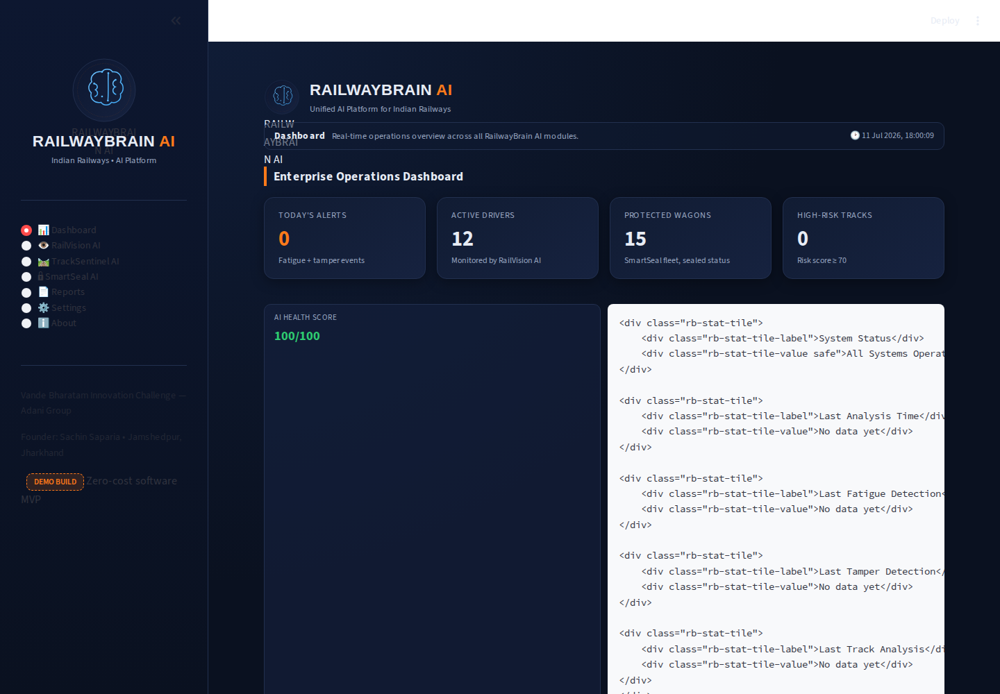

# 🧠 RailwayBrain AI

**India's First Unified AI Brain for Indian Railways**
*A working software MVP built for the Vande Bharatam Innovation Challenge (Adani Group)*

Built by **Sachin Saparia** — Jamshedpur, Jharkhand. B.Com | GST & Tally Professional | Individual Innovator.

---

## Overview

RailwayBrain AI is **one unified Streamlit application** (not three separate
demos) demonstrating the technical feasibility of three proposals already
submitted to, and marked *In Process* by, the Indian Railways Innovation Portal:

| Module | Proposal ID | What it does |
|---|---|---|
| 🧠 **RailVision AI** | IC0000000170 | Driver fatigue detection from camera footage |
| 🛤️ **TrackSentinel AI** | IS0000000165 | Rail defect / crack growth prediction (Paris Law) |
| 🔒 **SmartSeal AI** | IS0000000163 | Freight consignment IoT e-Seal security simulation |

Every score, chart, and recommendation shown in the app is **computed live**
from whatever image, video, or CSV you provide — nothing is hardcoded or
pre-baked. Where real Railway hardware/data feeds are unavailable (GPS
telemetry, tamper sensors, USFD history), the app clearly labels that data
as **SIMULATED** with an on-screen badge — see [About](#what-is-real-vs-simulated)
below for the full real-vs-simulated breakdown.



---

## Quick Start

```bash
git clone <your-repo-url>
cd RailwayBrainAI
./start.sh
```

Or manually:

```bash
python -m venv .venv && source .venv/bin/activate
pip install -r requirements.txt
streamlit run app.py
```

Full details: [`docs/INSTALLATION.md`](docs/INSTALLATION.md)

---

## Architecture

```
RailwayBrainAI/
├── app.py                     # Main entrypoint — sidebar nav + splash/bootstrap
├── config.py                  # Central thresholds, paths, theme colors
├── requirements.txt
├── start.sh                   # One-command local launch script
│
├── backend/
│   ├── database/
│   │   ├── db_manager.py      # SQLite schema + connection + CRUD helpers
│   │   └── seed_data.py       # Simulated demo data generator
│   ├── railvision/
│   │   └── fatigue_engine.py  # OpenCV Haar-cascade fatigue detection (REAL)
│   ├── tracksentinel/
│   │   └── crack_growth_model.py  # Paris Law fracture mechanics (REAL)
│   └── smartseal/
│       └── tamper_simulator.py    # GPS/tamper simulation engine
│
├── frontend/
│   ├── ui_helpers.py           # Shared KPI cards, status pills, theming
│   ├── css/theme.css           # Enterprise dark-blue + orange theme
│   └── pages/
│       ├── dashboard_page.py
│       ├── railvision_page.py
│       ├── tracksentinel_page.py
│       ├── smartseal_page.py
│       ├── reports_page.py
│       ├── settings_page.py
│       └── about_page.py
│
├── assets/logos/railwaybrain_logo.svg
├── sample_data/                # Sample CSV templates
├── screenshots/                # App screenshots (this README + presentation)
├── docs/                       # Installation / Testing / Deployment guides
└── presentation/                # Pitch-deck-ready assets
```

**Data flow:** every module writes to the same SQLite database
(`backend/database/railwaybrain.db`), so the Dashboard and Reports pages
aggregate real, cross-module activity — this is the "unified" part of
RailwayBrain AI, not three siloed demos glued together.

---

## Modules

### 🧠 Dashboard
Enterprise KPI overview: today's alerts, active drivers, protected wagons,
high-risk tracks, live CPU/Memory gauges, a 14-day alert timeline chart, and
recent events across all three modules.

### 👁️ RailVision AI — Driver Fatigue Detection
- Upload an image or video of a driver-facing camera feed.
- **Real** OpenCV Haar-cascade face + eye detection runs on your file.
- Computes blink count, eye-closure %, fatigue score, attention score.
- Classifies driver status: `SAFE` / `WARNING` / `DROWSY`.
- Saves annotated screenshots + full event history to the database.
- Generates a plain-language AI recommendation for cab alerting.

*Full hardware version (per proposal IC0000000170): dual 4K/IR thermal
cameras + NVIDIA Jetson Orin NX + YOLOv9 obstacle detection. This demo is
the software-only, laptop-buildable subset of that pipeline.*

### 🛤️ TrackSentinel AI — Rail Defect Growth Prediction
- Implements the **Paris Law** fatigue crack-growth model
  (`da/dN = C·(ΔK)^m`), calibrated per Indian rail grade (90UTS / HH / SH).
- Generate a simulated multi-cycle USFD inspection history for any track
  segment, or upload your own CSV (`track_id, inspection_date,
  crack_length_mm, mgt_cumulative`).
- Outputs: crack growth rate, risk score (0–100), remaining service life
  (MGT), and a maintenance-priority recommendation.
- Risk heatmap + priority ranking dashboard across all analysed tracks.

### 🔒 SmartSeal AI — Freight Consignment Security
- Live Leaflet (via Folium) map of simulated wagon GPS positions across a
  Jharkhand/East-India freight corridor.
- **SIMULATE TAMPER** button triggers one of the 6 real sensor types named
  in proposal IS0000000163 (magnetic door contact, cable pull-force,
  3-axis accelerometer, light sensor, seal-replacement detector,
  signal-jammer detector).
- Generates a severity-graded RPF dispatch recommendation and logs the
  event to a resolvable timeline.

### 📄 Reports
Export any module's data as CSV or a formatted PDF report (via ReportLab),
plus cross-module analytics (status distributions, severity breakdowns,
risk bands).

### ⚙️ Settings
Database table row counts, demo-data reseed/clear controls, and a read-out
of the detection thresholds used across modules.

### ℹ️ About
Founder background, proposal IDs, roadmap, and — most importantly — a full
**real vs. simulated capability table** so nothing in this MVP overstates
what is and isn't live computation.

---

## What Is Real vs. Simulated

| Capability | This Demo | Full Hardware Deployment |
|---|---|---|
| Face / eye detection | **Real** — OpenCV runs on your uploaded file | YOLOv9 + dual 4K/IR cameras on NVIDIA Jetson |
| Fatigue scoring | **Real** — computed from actual detections | Same algorithm class, calibrated on fleet data |
| Crack growth prediction | **Real** — Paris Law physics computed live | Same model, XGBoost-calibrated on RDSO USFD history |
| USFD inspection history | Simulated unless you upload a CSV | Ingested from Railway USFD trolleys / OCR |
| Wagon GPS | Simulated random-walk | Real u-blox GPS via LTE-M/NB-IoT hardware |
| Tamper events | Simulated (user-triggered, mapped to real sensor types) | Real magnetic/cable/accelerometer/light sensors |
| Recommendations | **Real** — generated live from actual output | Same engine, feeding real RPF/maintenance dispatch |

---

## Tech Stack

Python · Streamlit · OpenCV (opencv-python-headless) · Plotly · Pandas ·
NumPy · SQLite · Folium (Leaflet.js) · ReportLab · psutil

No TensorFlow, no MediaPipe, no paid APIs — every dependency is free/open-source.

---

## Roadmap & Future Scope

- **Phase 1 (Yr 1–2, this repo):** RailVision AI, TrackSentinel AI, SmartSeal AI.
- **Phase 2 (Yr 3–4):** Predictive Maintenance, Revenue Intelligence, Energy
  Intelligence, Staff Intelligence, Procurement Intelligence.
- **Phase 3 (Yr 5+):** Unified Knowledge Graph connecting all 17+ Indian
  Railways IT systems (PRS, FOIS, NTES, iMMS, IREPS, GeM, RDSO, Kavach…).
- Swap simulated GPS/tamper feed for real IoT hardware telemetry.
- Swap Haar-cascade pipeline for the full YOLOv9 + thermal fusion stack.
- Connect TrackSentinel AI to Railway's digitised USFD records via CRIS API.

See [`docs/DEPLOYMENT.md`](docs/DEPLOYMENT.md) for how this scales from a
free Streamlit Cloud demo to a production pilot deployment.

---

## Documentation

- [Installation Guide](docs/INSTALLATION.md)
- [Testing Guide](docs/TESTING.md)
- [Deployment Guide](docs/DEPLOYMENT.md)

## Contact

Sachin Saparia · Jamshedpur, Jharkhand · sachinsaparia123@gmail.com
